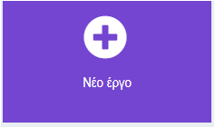

## Αρχική Οθόνη

Έχετε μια ιδέα για ποια άσκηση θέλεις να κάνεις έναν βοηθό;

Το πρώτο βήμα είναι να δημιουργήσεις μια αρχική οθόνη, που να περιλαμβάνει ένα κινούμενο σχέδιο και οδηγίες για το πώς να ξεκινήσεις την άσκηση.

<p style="border-left: solid; border-width:10px; border-color: #0faeb0; background-color: aliceblue; padding: 10px;">
  <span style="color: #0faeb0">Ο σχεδιασμός **User experience** </span> είναι σημαντικό μέρος της δημιουργίας ενός προϊόντος. Σημαίνει να σκέφτεσαι τρόπους για να κάνεις τα προγράμματά σου εύκολα στην κατανόηση και τη χρήση.
</p>

### Αποφάσισε για τη δραστηριότητά σου

\--- task ---

Για ποια άσκηση κάνετε τον βοηθό;

Θα μπορούσε να είναι για:

- 🏃🏽‍♀️ Τρέξιμο
- Να παίξεις ένα άθλημα, όπως ⚽️ ποδόσφαιρο ή 🎾 τένις
- 🧘🏼 Να κάνεις διατάσεις ή γιόγκα
- 🥾 Να πας μια βόλτα για να εξερευνήσεις τη φύση

Το να είσαι ενεργός/ή είναι ένα σημαντικό μέρος της ευζωίας, αλλά η δραστηριότητα μπορεί να φαίνεται διαφορετική για μερικούς ανθρώπους. Εάν εσύ ή το άτομο για το οποίο δημιουργείς αυτό το πρόγραμμα αντιμετωπίζει προκλήσεις στις μετακινήσεις, σκέψου να φτιάξεις μια συσκευή που θα βοηθήσει την ενθάρρυνση σε κάτι όπως:

- 🧘🏼 Καθιστές διατάσεις
- 🕺🏾 Χορός
- 😮‍💨 Ασκήσεις αναπνοής

Μπορείς να επιλέξεις οποιαδήποτε δραστηριότητα που μπορεί να κάνεις εσύ ή ένας χρήστης.

\--- /task ---

### Δημιούργησε το έργο σου

\--- task ---

Άνοιξε το πρόγραμμα επεξεργασίας MakeCode στη διεύθυνση [makecode.microbit.org](https://makecode.microbit.org){:target="_blank"}.

\--- collapse ---

---

## title: Εκτός σύνδεσης έκδοση του επεξεργαστή

Υπάρχει επίσης μια [έκδοση του προγράμματος επεξεργασίας MakeCode με δυνατότητα λήψης](https://makecode.microbit.org/offline-app){:target="_blank"}.

\--- /collapse ---

\--- /task ---

Μόλις ανοίξει το πρόγραμμα επεξεργασίας, δημιούργησε ένα νέο έργο και δώσε ένα όνομα στο έργο σου.

\--- task ---

Κάνε κλικ στο κουμπί Νέο έργο.



\--- /task ---

\--- task ---

Δώσε στο έργο σου ένα όνομα που να ταιριάζει στη δραστηριότητα για την οποία θέλεις να έχεις βοηθό!

**Συμβουλή:** Δώσε στο έργο σου ένα βοηθητικό όνομα που να σχετίζεται με τη δραστηριότητα που δημιουργείς. Αυτό θα διευκολύνει την εύρεσή του εάν δημιουργείτε άλλα έργα στο MakeCode.

\--- /task ---

### Δημιούργησε την αρχική οθόνη

Όταν ξεκινά το πρόγραμμά σου, δεν θέλεις να μπει κατευθείαν στη δραστηριότητα. Αντίθετα, θα δείξεις στον χρήστη σου μια αρχική οθόνη ώστε να γνωρίζει σε τι χρησιμεύει η συσκευή.

Θα το κάνεις αυτό με το μπλοκ `κατά την έναρξη`{:class='microbitbasic'} του νέου σου έργου.

\--- task ---

Πρόσθεσε μερικά μπλοκ `Βασικά`{:class='microbitbasic'} στο μπλοκ `κατά την εκκίνηση`{:class='microbitbasic'}. Τα μπλοκ που θα επιλέξεις θα εξαρτηθούν από το τι θέλεις να δει ο χρήστης σου όταν ξεκινά το πρόγραμμα.

Θα μπορούσας να εμφανίσεις ένα **εικονίδιο**, να δημιουργήσεις μια **κινούμενη εικόνα** ή να εμφανίσεις **κείμενο**.

[[[microbit-icons]]]

[[[microbit-animation]]]

[[[microbit-text]]]

Εάν η οθόνη εκκίνησης είναι περίπλοκη, ίσως να ήταν καλή ιδέα να οργανώσεις τον κώδικα σε μια **συνάρτηση**.

[[[microbit-function]]]

\--- /task ---

\--- task ---

Δοκίμασε την αρχική οθόνη.

Δείξε την σε έναν /μια φίλο/η και δες αν καταλαβαίνει τι κάνει το πρόγραμμα.

\--- /task ---

### Ξεκίνα τη δραστηριότητα

Θέλεις να βεβαιωθείς ότι η δραστηριότητα δεν ξεκινά έως ότου ο χρήστης **θέλει** να ξεκινήσει— μπορεί να χρειαστεί να εγκαταστήσει εξοπλισμό ή να ετοιμαστεί μετά την ενεργοποίηση του micro:bit.

\--- task ---

**Επίλεξε** πώς θέλεις ο χρήστης να ξεκινά τη δραστηριότητα.

Μπορείς να χρησιμοποιήσεις **κουμπιά** ή **χειρονομίες**.

\--- /task ---

\--- task ---

Πρόσθεσε οδηγίες (χρησιμοποιώντας το μπλοκ `εμφάνισε συμβολοσειρά`{:class='microbitbasic'}) στο μπλοκ `κατά την έναρξη`{:class='microbitbasic'} έτσι ώστε ο χρήστης να γνωρίζει τι να κάνει.

[[[microbit-text]]]

\--- /task ---

Στη συνέχεια, πρέπει να προσθέσεις κάποιο κώδικα που να εμποδίζει την έναρξη της δραστηριότητας έως ότου ο χρήστης ακολουθήσει τις οδηγίες σου.

Αυτό θα το κάνεις χρησιμοποιώντας "Μεταβλητές"{:class='microbitvariables'} και "Λογική"{:class='microbitlogic'}.

\--- task ---

Δημιούργησε μία νέα μεταβλητή με όνομα 'ξεκίνησα\`.

[[[microbit-create-variables]]]

\--- /task ---

\--- task ---

Στην κορυφή του μπλοκ "κατά την έναρξη"{:class='microbitbasic'}, "όρισε"{:class='microbitvariables'} τη μεταβλητή "ξεκίνα"{:class='microbitvariables'} σε "ψευδές"{:class ='microbitlogic'}.

```microbit
let started = false
```

\--- /task ---

\--- task ---

Πρόσθεσε ένα μπλοκ συμβάντος στο χώρο εργασίας σου για το **κουμπί** ή τη **χειρονομία** που θέλεις να χρησιμοποιήσεις για την έναρξη της δραστηριότητας.

[[[microbit-button-trigger]]]

[[[microbit-gesture-trigger]]]

\--- /task ---

\--- task ---

Μέσα στο συμβάν, `όρισε`{:class='microbitvariables'} τη μεταβλητή `ξεκίνα`{:class='microbitvariables'} σε `αληθές`{:class='microbitlogic'}.

Μπορείς να **διπλασιάσεις** το μπλοκ `ορισμός`{:class='microbitvariables'} που μόλις τοποθέτησες στο μπλοκ `κατά την έναρξη`{:class='microbitbasic'}.

\--- /task ---

### Δοκίμασε το έργο σου

\--- task ---

Βεβαιώσου ότι είσαι ικανοποιημένος/η με την επιλογή τηςαρχικής οθόνης, τις οδηγίες και το συμβάν που χρησιμοποιείς για να ξεκινήσει η δραστηριότητα.

\--- /task ---
