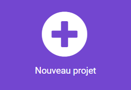

## Page d'accueil

As-tu une idée de l'exercice pour lequel tu souhaites créer un·e assistant·e ?

La première étape consiste à créer un écran de démarrage, comprenant une animation et des instructions sur la façon de démarrer l’exercice.

<p style="border-left: solid; border-width:10px; border-color: #0faeb0; background-color: aliceblue; padding: 10px;">
  Le design de <span style="color: #0faeb0">**l'expérience utilisateur·trice**</span> est un élément important lors de la création d'un produit. Cela signifie qu'il faut réfléchir aux moyens de rendre tes programmes faciles à comprendre et à utiliser.
</p>

### Décider de ton activité

--- task ---

Pour quel exercice fais-tu l'assistant·e ?

Cela pourrait être :

- 🏃🏽‍♀️ Course
- Pratiquer un sport, comme le ⚽️ football ou le 🎾 tennis
- 🧘🏼 Étirement, ou faire du yoga
- 🥾 Partir en promenade pour explorer la nature

Être actif·ve est un élément important du bien-être, mais l’activité peut être différente pour certaines personnes. Si toi, ou la personne pour laquelle tu crées ce programme, rencontre des difficultés à se déplacer, envisage de fabriquer un appareil pour t'aider à faire quelque chose comme :

- 🧘🏼 Étirements assis
- 🕺🏾 Danse
- 😮‍💨 Exercices de respiration

Tu peux choisir n’importe quelle activité que toi ou ton utilisateur·trice pouvez faire.

--- /task ---

### Créer ton projet

--- task ---

Ouvre l'éditeur MakeCode sur [makecode.microbit.org](https://makecode.microbit.org){:target="_blank"}.

--- collapse ---

---
title: Version hors ligne de l'éditeur
---

Il existe également une [version téléchargeable de l'éditeur MakeCode](https://makecode.microbit.org/offline-app){:target="_blank"}.

--- /collapse ---

--- /task ---

Une fois que l'éditeur est ouvert, crée un nouveau projet et donne un nom à ton projet.

--- task ---

Clique sur le bouton **Nouveau projet**.



--- /task ---

--- task ---

Donne à ton projet un nom qui corresponde à l'activité souhaitée !

**Astuce :** donne à ton projet un nom pratique en rapport avec le programme que tu crées. Cela permettra de le retrouver plus facilement si tu crées d'autres projets sur MakeCode.

--- /task ---

### Créer ton écran de démarrage

Lorsque ton programme démarre, tu ne veux pas qu'il passe directement à l'activité. Au lieu de cela, tu montreras à ton utilisateur·trice un écran de démarrage afin qu'il ou elle sache à quoi sert l'appareil.

Tu le feras dans le bloc `au démarrage`{:class='microbitbasic'} de ton nouveau projet.

--- task ---

Ajoute quelques blocs `Base`{:class='microbitbasic'} à ton bloc `au démarrage`{:class='microbitbasic'}. Les blocs que tu choisis dépendent de ce que tu souhaites que ton utilisateur·trice voie au démarrage du programme.

Tu peux afficher une **icône**, faire une **animation** ou afficher un **texte**.

[[[microbit-icons]]]

[[[microbit-animation]]]

[[[microbit-text]]]

Si ton écran de démarrage est compliqué, tu peux organiser le code dans une **fonction**.

[[[microbit-function]]]

--- /task ---

--- task ---

Teste ton écran de démarrage.

Montre-le à un·e ami·e et vois s'il ou elle sait ce que fait le programme.

--- /task ---

### Démarrer l'activité

Tu veux t'assurer que l'activité ne démarre que lorsque l'utilisateur·trice est **prêt·e**. Il ou elle peut avoir besoin d'installer du matériel ou de se préparer après que le micro:bit a été allumé.

--- task ---

**Choisis** comment tu veux que l’utilisateur·trice démarre l’activité.

Tu peux utiliser des **boutons** ou des **gestes**.

--- /task ---

--- task ---

Ajoute des instructions (en utilisant `afficher texte`{:class='microbitbasic'}) au bloc `au démarrage`{:class='microbitbasic'} afin que l'utilisateur·trice sache quoi faire.

[[[microbit-text]]]

--- /task ---

Ensuite, tu dois ajouter du code qui empêche l’activité de démarrer jusqu’à ce que l’utilisateur·trice suive tes instructions.

Tu feras cela en utilisant `Variables`{:class='microbitvariables'} et `Logique`{:class='microbitlogic'}.

--- task ---

Crée une variable appelée `démarré`.

[[[microbit-create-variables]]]

--- /task ---

--- task ---

En haut de ton bloc `au démarrage`{:class='microbitbasic'}, `définir`{:class='microbitvariables'} ta variable `démarré`{:class='microbitvariables'} sur `faux`{:class='microbitlogic'}.

```microbit
let démarré = false
```

--- /task ---

--- task ---

Ajoute un bloc d'événement à ton espace de travail pour le **bouton** ou le **geste** que tu souhaites utiliser pour démarrer l'activité.

[[[microbit-button-trigger]]]

[[[microbit-gesture-trigger]]]

--- /task ---

--- task ---

À l'intérieur de l'événement, définir la variable `démarré`{:class='microbitvariables'} sur `vrai`{:class='microbitlogic'}.

Tu peux **dupliquer** le bloc `définir`{:class='microbitvariables'} que tu viens de placer dans le bloc `au démarrage`{:class='microbitbasic'}.

--- /task ---

### Teste ton programme

--- task ---

Assure-toi que tu es satisfait·e de ton choix d’écran de démarrage, d’instructions et de l’événement que tu utilises pour démarrer l’activité.

--- /task ---
