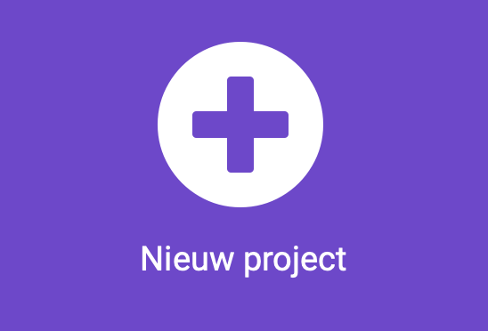

## Startscherm

Weet je al voor welke oefening je een assistent wilt maken?

De eerste stap is het maken van een opstartscherm, inclusief een animatie en instructies over hoe je de oefening kunt starten.

<p style="border-left: solid; border-width:10px; border-color: #0faeb0; background-color: aliceblue; padding: 10px;">
  Het ontwerpen van de <span style="color: #0faeb0">**gebruikerservaring**</span> is een belangrijk onderdeel van het maken van een product. Het betekent dat je nadenkt over manieren hoe je je programma's zo kunt maken dat ze gemakkelijk te begrijpen en te gebruiken zijn.
</p>

### Bepaal je activiteit

--- task ---

Voor welke oefening maak je de assistent?

Het kan zijn:

- 🏃🏽‍♀️ Hardlopen
- Een sport beoefenen, zoals ⚽️ voetbal of 🎾 tennis
- 🧘🏼 Stretchen, of yoga
- 🥾 Gaan wandelen om de natuur te verkennen

Actief zijn is een belangrijk onderdeel van ons welzijn, maar voor sommige mensen kan de activiteit er anders uitzien. Als jij, of de persoon voor wie je dit programma maakt, zich niet zo goed kan bewegen, overweeg dan om een apparaat te maken dat zoiets stimuleert als:

- 🧘🏼Zittend stretchen
- 🕺🏾Dansen
- 😮‍💨Ademhalingsoefeningen

Je kunt elke activiteit kiezen die jij of jouw gebruiker kan uitvoeren.

--- /task ---

### Maak je project

--- task ---

Open de MakeCode editor in [makecode.microbit.org](https://makecode.microbit.org){:target="_blank"}.

--- collapse ---

---

title: Offline versie van de editor
---

Er is ook een [downloadbare versie van de MakeCode-editor](https://makecode.microbit.org/offline-app){:target="_blank"}.

--- /collapse ---

--- /task ---

Zodra de editor is geopend, moet je een nieuw project aanmaken en je project een naam geven.

--- task ---

Klik op de knop **Nieuw project**.



--- /task ---

--- task ---

Geef je project een naam die overeenkomt met de activiteit waarvoor je een assistent gaat maken!

**Tip:** Geef je project een logische naam die betrekking heeft op het programma dat je aan het maken bent. Dit maakt het gemakkelijker om het terug te vinden als je nog andere projecten aanmaakt op MakeCode.

--- /task ---

### Maak je startscherm

Wanneer je programma opstart, wil je niet dat het direct naar de activiteit gaat. In plaats daarvan zal je je gebruiker een startscherm laten zien zodat ze weten waar het apparaat voor dient.

Je maakt dit in het `bij opstarten`{:class='microbitbasic'} blok van je nieuwe project.

--- task ---

Vanuit het blokmenu Basis{:class='microbitbasic'} sleep je enkele blokken naar het 'bij opstarten'{:class='microbitbasic'} blok. De blokken die je kiest zijn afhankelijk van wat je wil dat je gebruiker ziet wanneer het programma start.

Je kunt een **pictogram**, een **animatie** of **tekst** laten zien.

[[[microbit-icons]]]

[[[microbit-animation]]]

[[[microbit-text]]]

Als het startscherm ingewikkeld is, kun je de code overzichtelijker maken met behulp van een **functie**.

[[[microbit-function]]]

--- /task ---

--- task ---

Test je startscherm.

Laat het aan een vriend of vriendin zien en kijk of ze begrijpen wat het programma doet.

--- /task ---

### Start de activiteit

Je wilt er zeker van zijn dat de activiteit pas begint als de gebruiker er **klaar** voor is. Mogelijk moet hij of zij apparatuur instellen of zich klaarmaken nadat de micro:bit is ingeschakeld.

--- task ---

**Kies** hoe je wilt dat de gebruiker de activiteit opstart.

Je kunt **knoppen** of **gebaren** gebruiken.

--- /task ---

--- task ---

Voeg instructies (met behulp van `toon tekens`{:class='microbitbasic'}) toe aan het `bij opstarten`{:class='microbitbasic'} blok, zodat de gebruiker weet wat hij moet doen.

[[[microbit-text]]]

--- /task ---

Vervolgens moet je code toevoegen die voorkomt dat de activiteit begint zolang de gebruiker de instructies nog aan het volgen is.

Je doet dit met `Variabelen`{:class='microbitvariables'} en `Logisch`{:class='microbitlogic'}.

--- task ---

Maak een variabele met de naam `gestart`.

[[[microbit-create-variables]]]

--- /task ---

--- task ---

Bovenaan je `bij opstarten`{:class='microbitbasic'} blok, `stel`{:class='microbitvariables'} je je `gestart`{:class='microbitvariables'} variabele in op `onwaar`{:class='microbitlogic'}.

```microbit
let gestart = false
```

--- /task ---

--- task ---

Voeg een gebeurtenis blok toe aan je bewerkingspaneel voor de **knop** of het **gebaar** dat je wil gebruiken om de activiteit te starten.

[[[microbit-button-trigger]]]

[[[microbit-gesture-trigger]]]

--- /task ---

--- task ---

In de gebeurtenis `stel`{:class='microbitvariables'} dan de `gestart`{:class='microbitvariables'} variabele in op `waar`{:class='microbitlogic'}.

Je kunt het `stel`{:class='microbitvariables'} blok dat je zojuist in het `bij opstarten`{:class='microbitbasic'} blok hebt geplaatst dupliceren.

--- /task ---

### Test je programma

--- task ---

Zorg ervoor dat je tevreden bent met de keuze voor het startscherm, de instructies en de gebeurtenis die je gebruikt om de activiteit te starten.

--- /task ---
